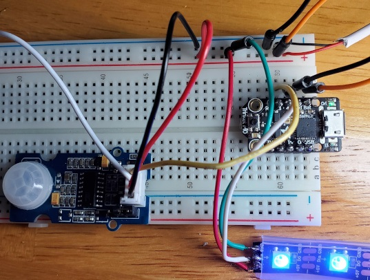

# Under-the-Cabinet Motion Activated LEDs Project
Circuit Python Project that integrates under the cabinet, kitchen counter LED lighting that is activated by motion.

## Harware Used:
- [Adafruit Trinket M0](https://www.adafruit.com/product/3500)
- [Grove PIR Motion Sensor](http://wiki.seeedstudio.com/Grove-PIR_Motion_Sensor/)
- 5050 LED strip with 100 LEDs
- External 5VDC Power Supply

## Software Libraries Used:
- [Circuit Python 5.x](https://circuitpython.org/board/trinket_m0/)

## Connections:
 - Trinket M0
     - Gnd   <-> Negative side of 5VDC power source
     - Bat   <-> Positive side of 5VDC power source
     - PIN 4 <-> DIN on 5050 LED Strip
     - PIN 3 <-> D1 on PIR
 - 5050 LED Strip
     - GND   <-> Negative side of 5VDC power source
     - DIN   <-> PIN 4 Trinket M0
     - +5V   <-> Positive side of 5VDC power source
 - PIR
     - GND   <-> Negative side of 5VDC power source
     - VCC   <-> Postivie side of 5VDC power source
     - D1    <-> PIN 3 Trinket M0
 
 
